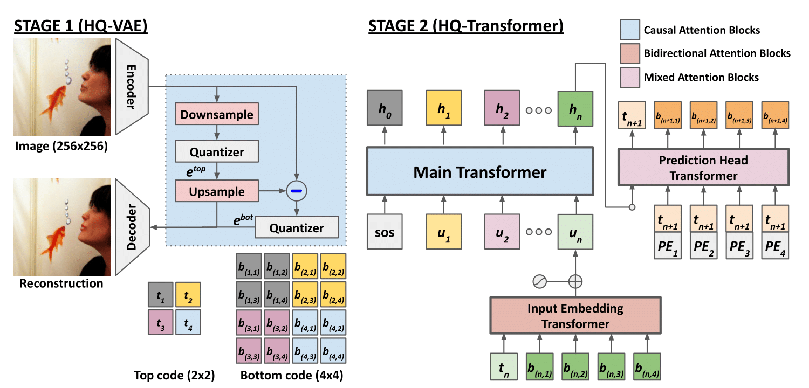

# Locally Hierarchical Auto-Regressive Modeling for Image Generation (HQ-Transformer)
The official implementation of ["Locally Hierarchical Auto-Regressive Modeling for Image Generation"](https://openreview.net/forum?id=NYF6jNTAui)
- Tackgeun You, Saehoon Kim, Chiheon Kim, Doyup Lee, Bohyung Han, (**NeurIPS 2022**)

<center></center>

## Requirements
We have tested our codes on the environment below
- `Python 3.7.10` / `Pytorch 1.10.0` / `torchvision 0.10.0` / `CUDA 11.3` / `Ubuntu 18.04`  .

Please run the following command to install the necessary dependencies
```bash
pip install -r requirements.txt
```


## Coverage of Released Codes
- Implementation of HQ-VAE and HQ-Transformer
- Pretrained checkpoints of HQ-VAE and HQ-Transformer
- Training pipeline of HQ-VAE
- Image generation and its evaluation pipeline of HQ-VAE and HQ-Transformer


## HQ-Transformer Sampling demo
Refer the [jupyter notebook script](scripts/sampling_demo.ipynb).


## Experiment Command and Pretrained Checkpoints
Experiment commands and configurations are described here in [experiment commands](configs/README.md).
We provide [pretrained checkpoints of HQ-VAE and HQ-Transformers](checkpoints/README.md) to reproduce the main results in the paper.


## BibTex
```
@inproceedings{you2022hqtransformer,
  title={Locally Hierarchical Auto-Regressive Modeling for Image Generation},
  author={You, Tackgeun and Kim, Saehoon and Kim, Chiheon and Lee, Doyup and Han, Bohyung},
  booktitle={Proceedings of the International Conference on Neural Information Processing Systems},
  year={2022}
}
```


## License
- MIT License.


## Acknowledgement
Our implementation is based on [rq-vae-transformer](https://github.com/kakaobrain/rq-vae-transformer) and [minDALL-E](https://github.com/kakaobrain/minDALL-E).
Our transformer-related implementation is inspired by [minGPT](https://github.com/karpathy/minGPT).
We appreciate the authors of [VQGAN](https://github.com/CompVis/taming-transformers) for making their codes available to public.
